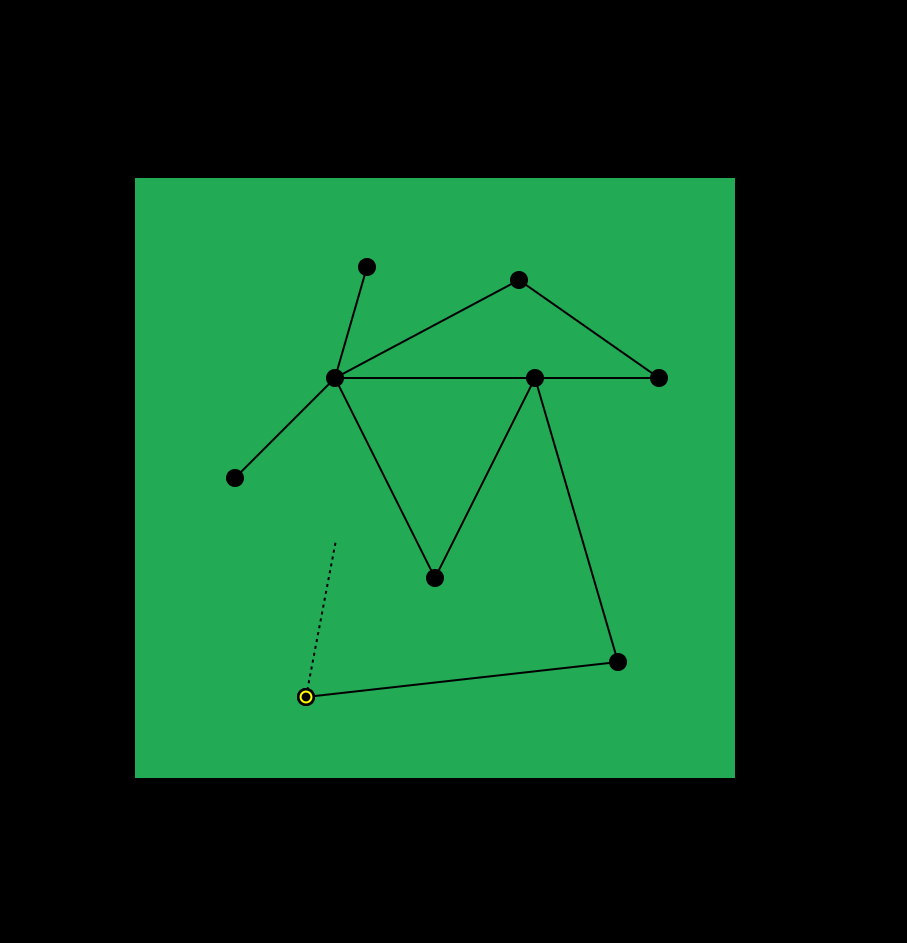

# Open world

## phase 1

- Create an open world with nodes and edges.
- User can create their own nodes and edges in the map.
- User can move mouse and add new node in the context with left click
- A new edge will be added when ever user adds a node.
- A preview edge will be shown when mouse moved

## phase 2

- Zoom feature

