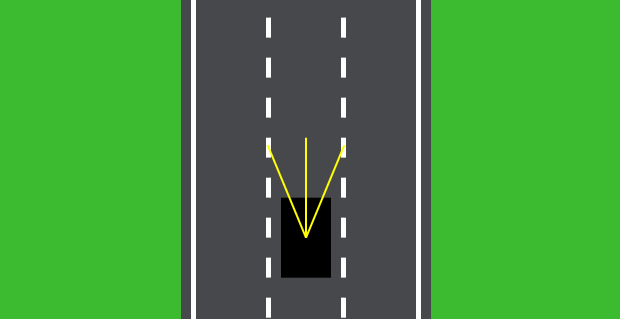

# Self Drive Car

## phase 1

- A simple canvas having road with lanes and borders
- A car (represented as a black rectangle) which is having forward, backwar, left and right controls
- A Sensor that can detect the road boarders.

## phase 2
